# KMZViewer

Simple powerfull tool to view kml/kmz files

Это небольшая но весьма мощная утилита для просмотра kml и kmz файлов

[KMZ files Repository](https://github.com/dkxce/KMZ_FILES)     
[Репозиторий KMZ файлов](https://github.com/dkxce/KMZ_FILES)     

---

Это программа для просмотра POI на тайловых картах.     
И она может работать с APRS пакетами! и данными FlightRadar24!    
Поддерживает райстровые [MBTiles](https://wiki.openstreetmap.org/wiki/MBTiles) файлы.  

Программа умеет отображать на карты объекты из:    
**KMZ**, **KML**, **GPI** (Garmin Points of Interests), **Progorod**, **WPT**, **GDB**, **FIR** файлов.

Открывает файлы, сохраненные в [Google Maps](https://www.google.com/maps/d/), [SASPlanet](http://www.sasgis.org/sasplaneta/) и [KMZRebuilder](https://github.com/dkxce/KMZRebuilder)
Отображает вложенные в файл (kmz) картинки и картинки по url.
Отсутствует прямое ограничение на количество отображаемых объектов.

Повзоляет фильтровать, сортировать, изменять объекты.
Поддерживает точки, полигоны, линии и значки.     
Поддерживает отображение точек из файлов GPI (Garmin Points of Interests).     
Для сохранения файлов в формате GPI используйте [KMZRebuilder](https://github.com/dkxce/KMZRebuilder).     

Умеет сохранять данные в KMZ, CSV, HTML, RTF, WPT, Progorod

Поддерживат поиск OSM (русский).     
Поддерживает визуализацию маршрутов dkxce Route Engine и [OSRM](http://project-osrm.org/docs/v5.15.2/api/).     

Работает с OSM тайлами, Google, Ovi, Here, Kosmosnimki.
Пожжерживат пользовательские тайлы.
Возможность загружать тайлы с произвольных серверов.
Умеет работать с кэшем SAS.Планета.
Умеет работать с тайлами, сохранеными на диске.

**Полноценная поддержка GPI файлов**:
- Multilanguage (EN or any latin, RU or anty ciryllic)
- Категории объектов (Layers (Categories))
- Точки интересов (POI)
- Примечания (POI Description)
- Комментарии (POI Comment (load/save from/to desc))
- Адресная информация (POI Address (load/save from/to desc))
- Контактная информация (POI Contact (load/save from/to desc))
- Предупреждения (POI Alert (load/save from/to desc)) со звуками и установками срабатывания
- Иконки (POI Bitmap (get/set from/to kml style))
- Картинки (POI Image (get/set from/to kml style))

Позволяет отображать объекты, полученные через APRS.
С помощью программы можно подключиться к APRS-IS,
AGW, KISS TNС и отображать полученные объекты с координатами
на карте (Beacon, WX, Point). Работает с Serial/COM Kiss.
Есть возможность следить за объектом при его перемещении.

Основное окно карты    
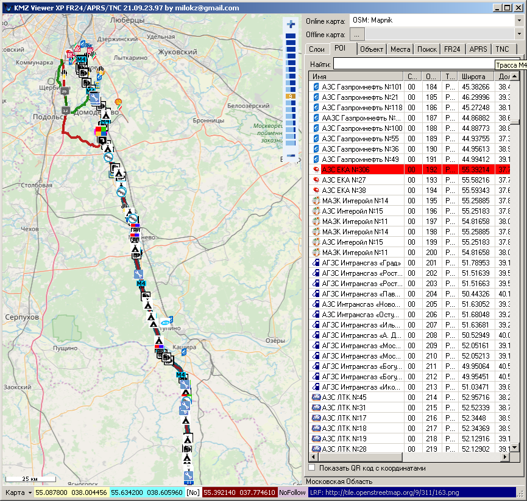    
APRS данные    
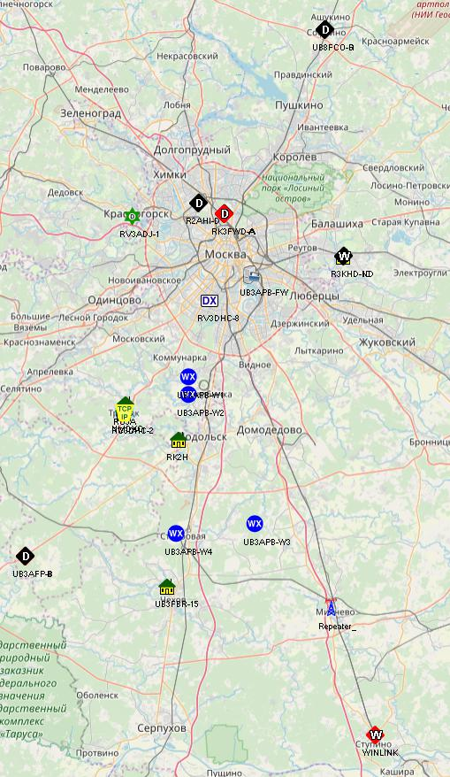     
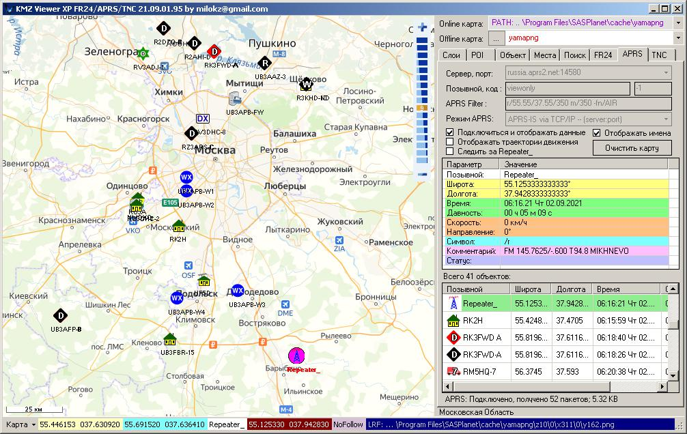     
FlightRadar24 данные     
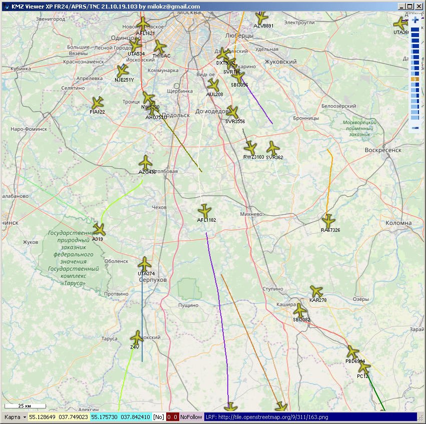    
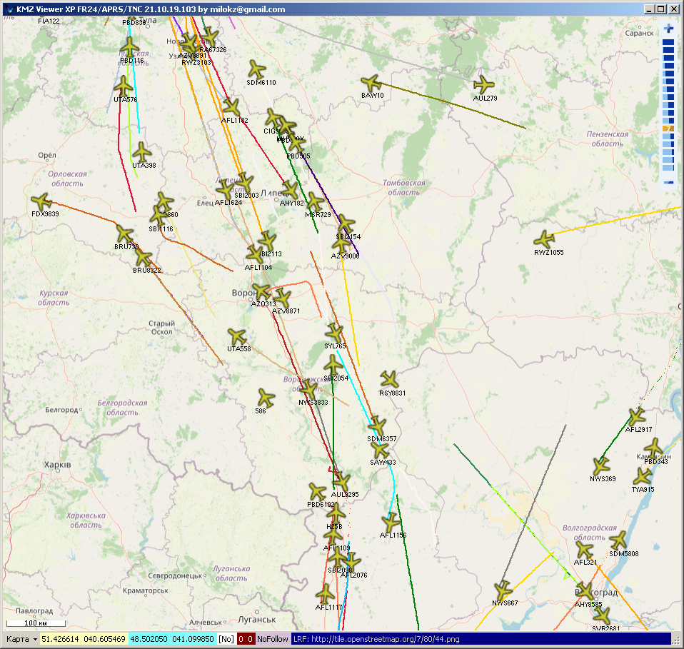     
Просмотр точек вдоль маршрута    
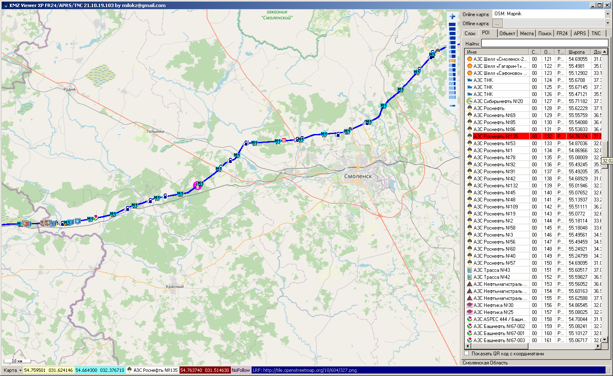    
Отображение данных карты     
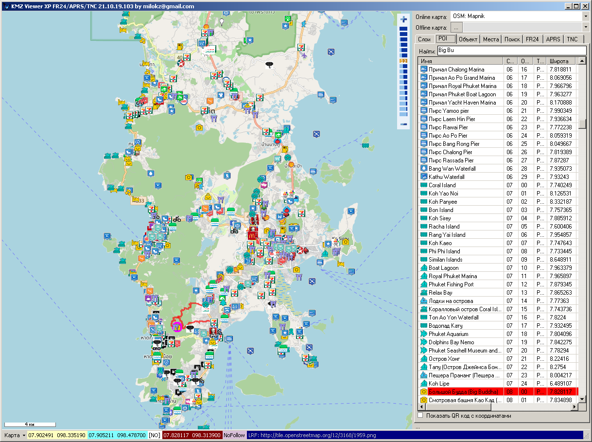
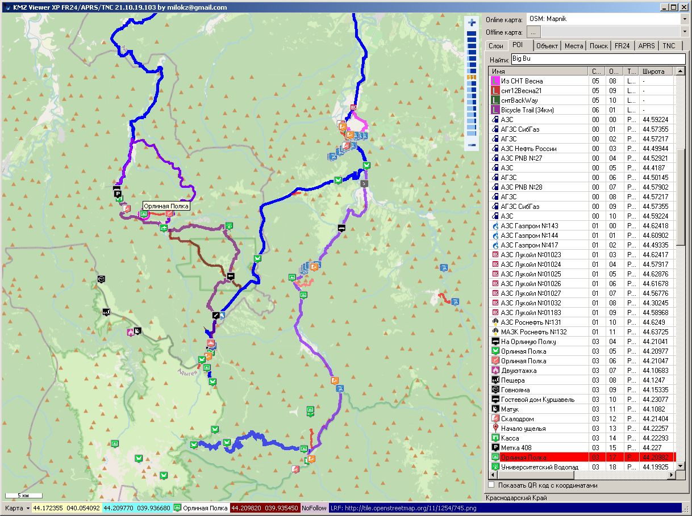     
Экспорт данных     
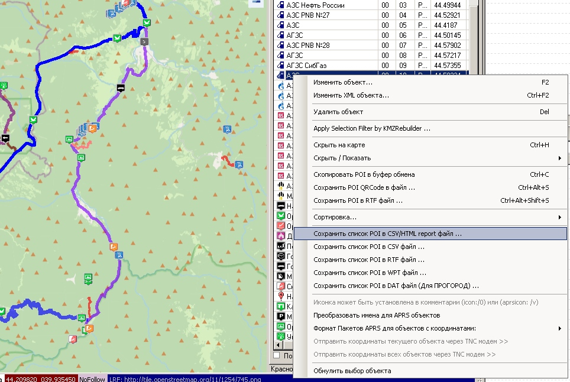      
Маршруты     
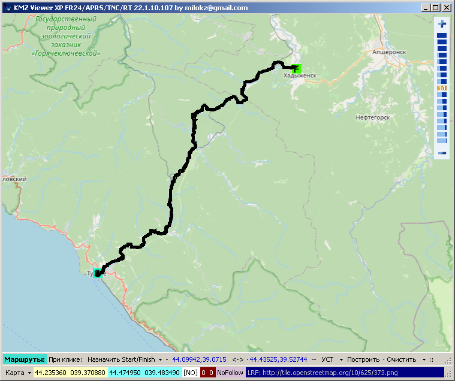     
Предпочтения     
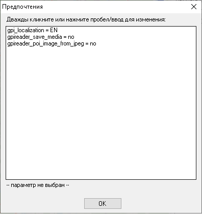     
